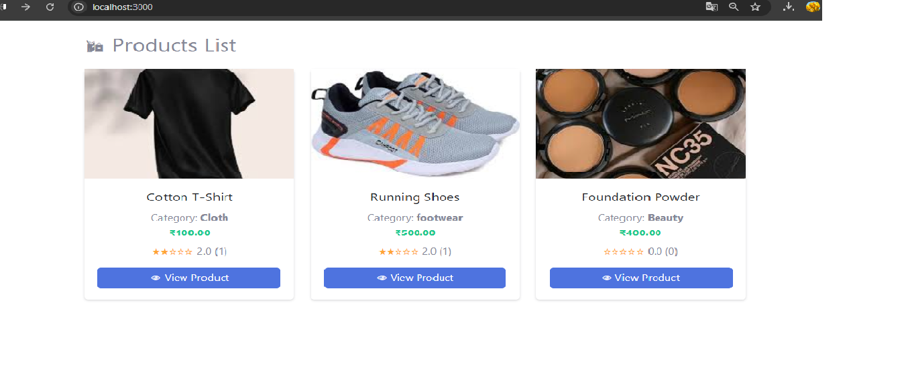
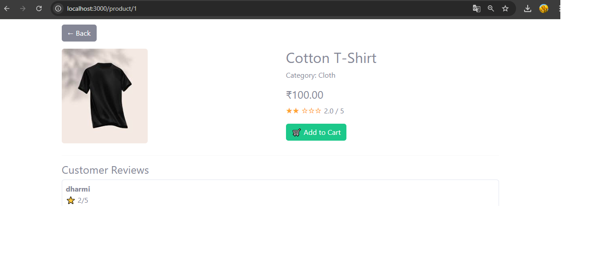
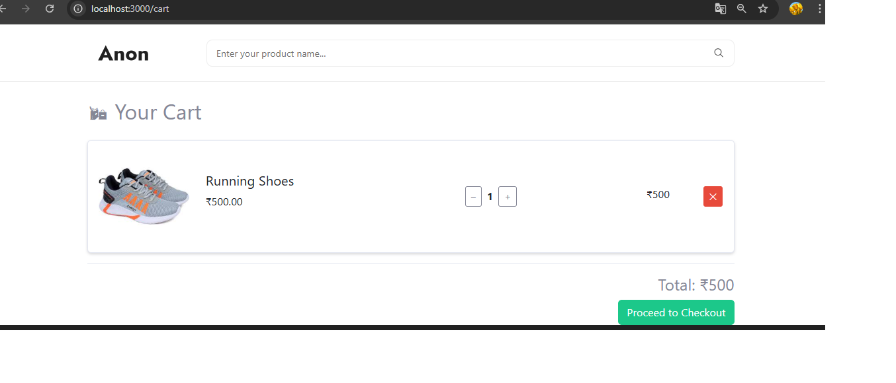
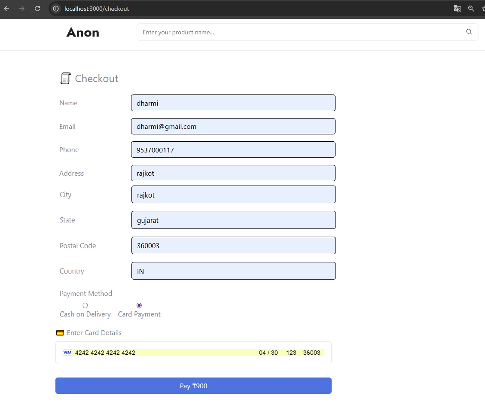
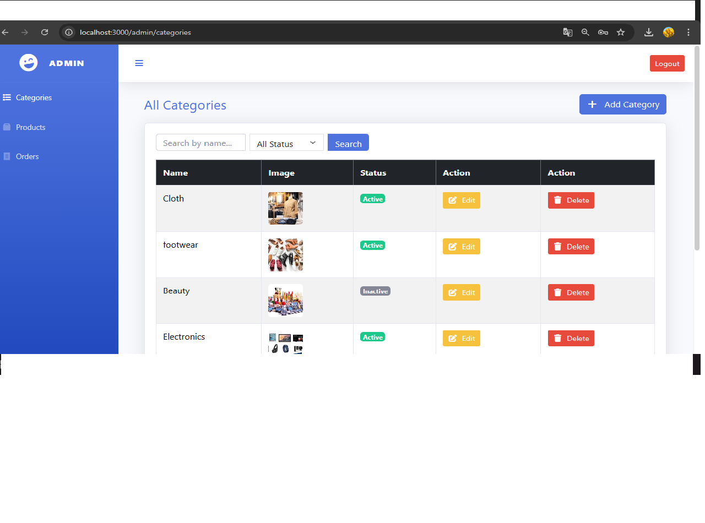
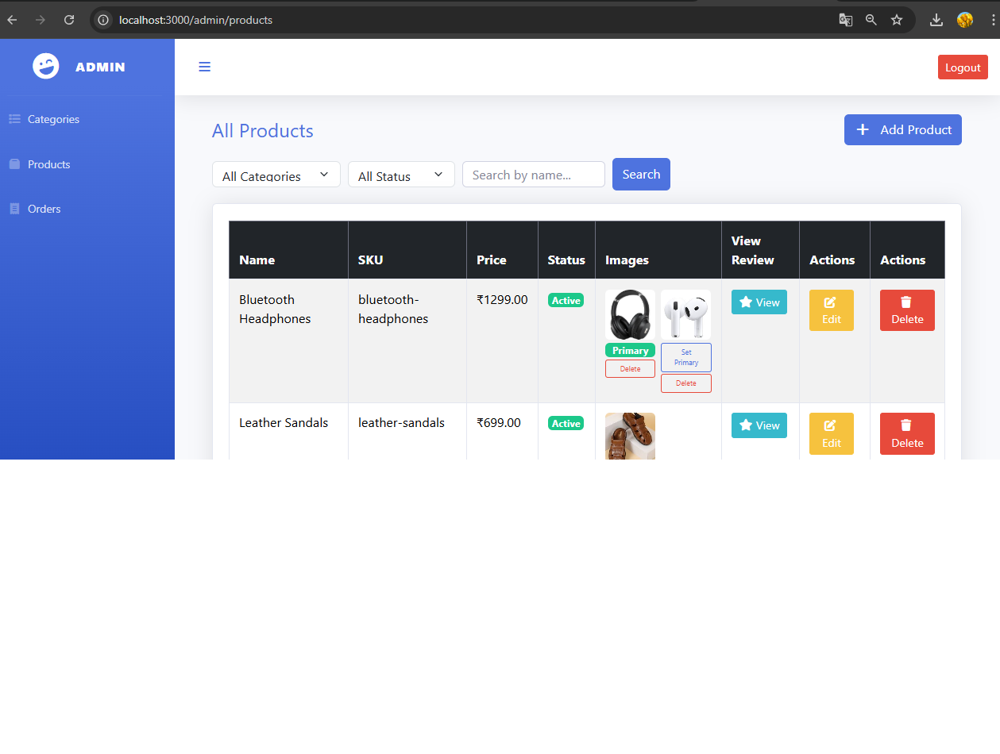
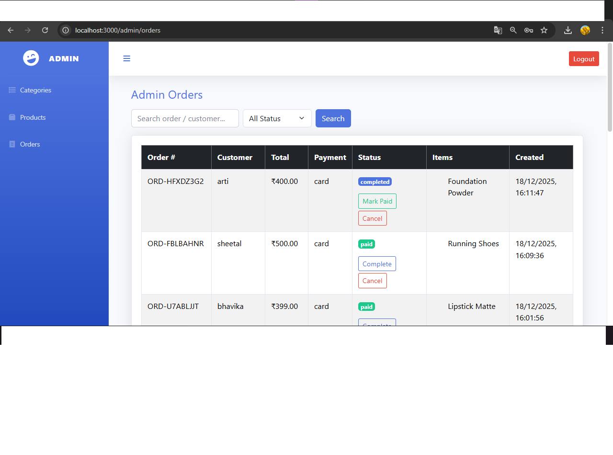
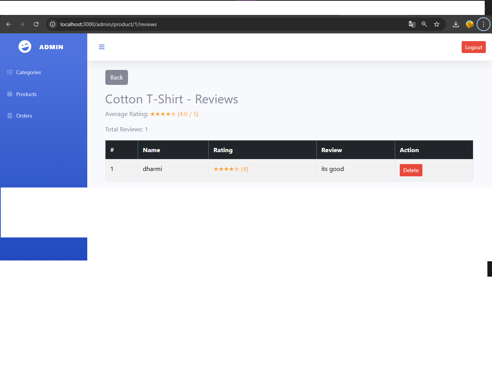

# E-Commerce Project (Laravel + React)

A full-stack e-commerce application built with **Laravel** for the backend and **React** for the frontend.  
Features include product browsing, cart, checkout, and admin management.

---

##  Features

### Client Side
- Product listing (`product-list`)
- Product details (`product-detail`)
- Add products to cart (`cart-page`)
- Checkout process (`checkout`)

### Admin Side
- Manage categories (`admin-category-list`)
- Manage products (`admin-product-list`)
- Manage orders (`admin-order-list`)
- View product reviews (`admin-review`)

---

##  Screenshots

### Client Side
  
  
  
  

### Admin Side
  
  
  
  

---

##  Tech Stack

- **Backend:** Laravel, MySQL  
- **Frontend:** React, Axios, React Router  
- **Authentication:** Laravel Sanctum / JWT  
- **Payments:** Stripe  
- **Styling:** Tailwind CSS (or your preferred library)

---

##  Author

- Name: Dharmi Rupapara  
- GitHub: [github.com/dharmirupapara9537](https://github.com/dharmirupapara9537)  
- Email: dhamirupapara@gmail.com

---

##  License

This project is open-source under the MIT License.
